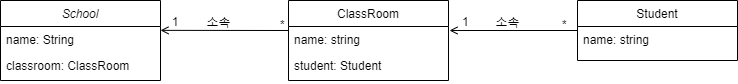

# 프로젝트 목적
* JPA LAZY관계에서 어떻게 쿼리가 수행되는지 관찰
* github issues를 이용하여 프로젝트 개발 이력 관리

 

# 세부 목표
- [x] 로직 실행 전 유효성 검사 수행(예: 학생을 추가할 때 학생이 있는지 검사)
- [x] Custom ExceptionHandler 등록
    * 유효성 검사를 실패하면 409(Conflict) 리턴
- [x] JPA LAZY관계일 때 쿼리가 어떻게 나가는지 확인
- [x] junit5 h2 인메모리 설정
- [x] junit5으로 service계층 테스트
- [ ] request valid를 이용하여 유효성 검사
- [ ] junit5(Mock)으로 controller계층 테스트
- [ ] cicd 생성(jenkins, dockerfile, minikube)
- [ ] 공개적으로 배포될 시 jenkins에서 1시간에 1번 container rollout
- [ ] frontend(vuejs) 프로젝트 생성과 연동 

 

# 버전 관리
## v1
* 단방향 JPA 연관관계 설정

# 개발 이력관리
* git issue 참고

 

# 고민사항
* 로직 수행 전 유효성 검사를 어떻게 통일 시킬 수 있을까?(예: 인터페이스)
